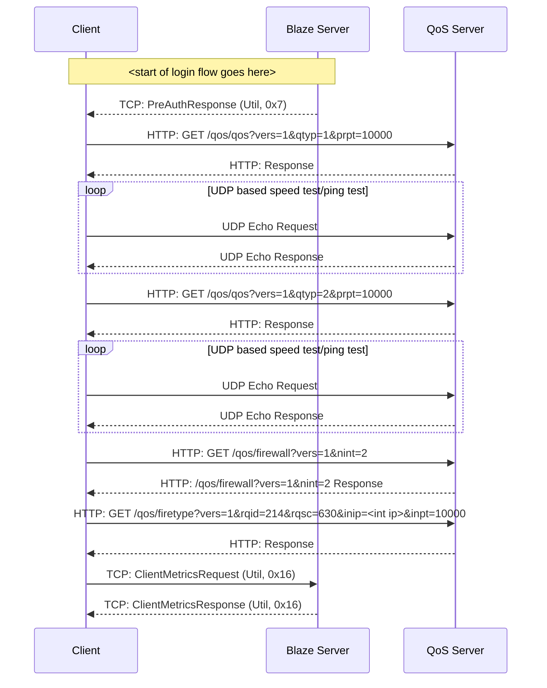

# Util, Client Metrics

This flow is used in combination with the QoS servers returned as part of the PreAuthResponse (Util, 0x7). This reports the ping/speed test/firewall results gained from the QoS servers.

