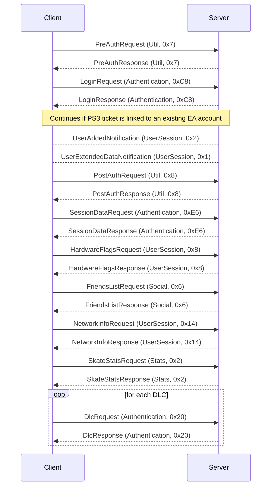

# Login, Existing Account

This is the first flow that occurs against the application specific blaze server, for Skate 3 this is hosted at eadpgs-blapp001 port: 10744. This flow happens after you have already logged into EA. That first login associates your PS3 userId to your EA account. This means you can remove your save and not be prompted to re login to EA.

