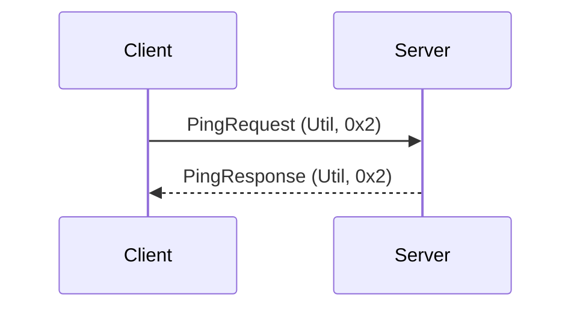

# Util, Ping

This is a simple ping request that returns the server time to make sure the server is still alive

```mermaid
sequenceDiagram
    Client->>Server: PingRequest (Util, 0x2)
    Server-->>Client: PingResponse (Util, 0x2)
```