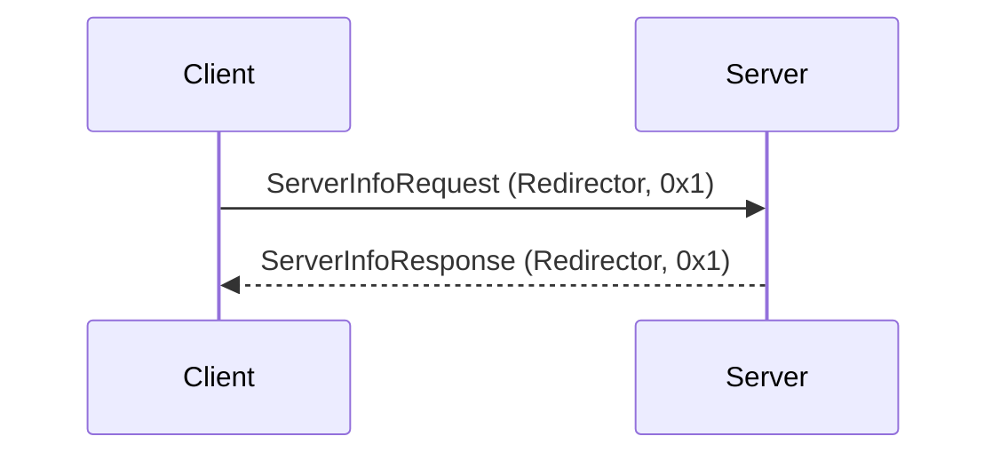

# Redirector, Server Info

This is the first request ever sent to the blaze server. This request returns details for the application specific blaze server, this is hosted on gosredirector port: 42100

